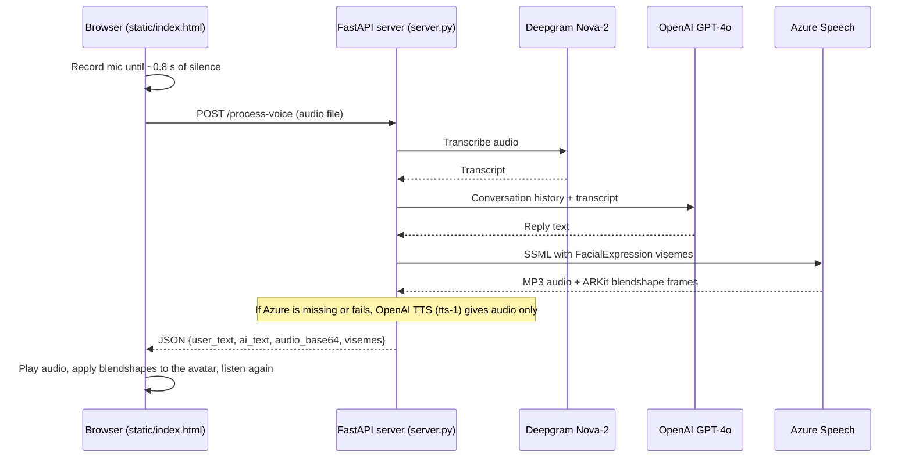

# Interactive 3D Avatar AI Agent

[](https://python.org)
[](https://fastapi.tiangolo.com)
[](https://threejs.org)
[](https://platform.openai.com)
[](https://deepgram.com)
[](https://azure.microsoft.com/en-us/products/ai-services/ai-speech)
[](#quick-start)
[](LICENSE)
[](https://riverborn.com)

**A browser-based voice agent with a 3D avatar: you talk, it answers out
loud, and the avatar's mouth moves with the words.**

A small FastAPI server takes your recorded speech, transcribes it with
Deepgram Nova-2, gets a reply from OpenAI GPT-4o, and turns the reply into
speech with Azure Speech. Azure also returns ARKit facial blendshape data for
each frame, which the browser applies to a Ready Player Me `.glb` avatar
rendered with three.js and the TalkingHead library. Listening is hands-free:
the page detects when you start and stop talking.

> [!NOTE]
> **Built by [Riverborn Limited](https://riverborn.com)**, an AI solutions
> company from Dhaka, Bangladesh. We build agentic AI, generative AI and
> conversational AI (voice, chat and RAG). If you need help building a voice
> agent or another AI product,
> **[book a call](https://riverborn.com/#book)** or email
> **[hello@riverborn.com](mailto:hello@riverborn.com)**.

## Table of contents

- [Features](#features)
- [How it works](#how-it-works)
- [Tech stack](#tech-stack)
- [Quick start](#quick-start)
- [Configuration](#configuration)
- [Project layout](#project-layout)
- [Limitations and known issues](#limitations-and-known-issues)
- [About Riverborn](#about-riverborn)
- [License](#license)
- [Acknowledgements](#acknowledgements)

## Features

- **Hands-free listening.** The page watches microphone volume and stops
  recording after about 0.8 seconds of silence, then sends the clip to the
  server. It starts listening again after the avatar finishes speaking.
- **Speech-to-text** with Deepgram Nova-2 (`en-US`, smart formatting).
- **Multi-turn replies** from OpenAI GPT-4o (`max_tokens=200`), with the
  conversation kept in server memory.
- **Speech plus lip-sync data** from Azure Speech
  (`en-US-AvaMultilingualNeural` voice). SSML with
  `<mstts:viseme type="FacialExpression"/>` makes Azure return ARKit
  blendshape frames along with the MP3 audio.
- **3D avatar** (`static/avatar_fixed.glb`, a Ready Player Me model) rendered
  in the browser with three.js and TalkingHead. Mouth and jaw blendshapes are
  interpolated between Azure frames and synced to audio playback.
- **Fallbacks.** If Azure is not configured or fails, the server uses OpenAI
  TTS (`tts-1`, voice `alloy`) instead, and the browser moves the jaw based on
  audio volume rather than blendshape data.
- **Live transcript panel** showing what you said and what the agent replied.
- **Terminal-only agent** (`agent.py`): a separate script that listens on a
  local microphone, answers with GPT-4o and speaks with ElevenLabs. No avatar.

## How it works



The server has two routes:

| Route | What it does |
|---|---|
| `GET /` | Serves `static/index.html`. |
| `POST /process-voice` | Takes a multipart `audio` file and returns the transcript, reply text, base64 MP3 audio and a list of `{time, blendshapes}` frames. |

Static files (the page, `blendshapes.js` and the avatar) are served from
`/static`. `static/blendshapes.js` lists the 55 ARKit blendshape names in the
order Azure returns them, so each Azure value can be matched to the right
morph target on the model. Only the mouth and jaw shapes are applied, each
scaled by a weight in the `WEIGHTS` table in `static/index.html`.

## Tech stack

| Layer | Technology |
|---|---|
| Backend | Python, [FastAPI](https://fastapi.tiangolo.com/), Uvicorn |
| Speech-to-text | [Deepgram](https://deepgram.com/) Nova-2 (REST API via `requests`) |
| Language model | [OpenAI](https://platform.openai.com/) GPT-4o (`openai` SDK) |
| Text-to-speech and lip-sync | [Azure Speech](https://azure.microsoft.com/en-us/products/ai-services/ai-speech) (`azure-cognitiveservices-speech`); OpenAI `tts-1` as fallback |
| Frontend | Plain HTML and JavaScript (ES modules), Tailwind CSS from its CDN, no build step |
| 3D rendering | [three.js](https://threejs.org/) 0.180 and [TalkingHead](https://github.com/met4citizen/TalkingHead) 1.7, loaded from jsDelivr |
| Avatar | Ready Player Me `.glb` with ARKit and viseme morph targets |
| Terminal agent | `SpeechRecognition` (Google Web Speech), GPT-4o, [ElevenLabs](https://elevenlabs.io/) |

## Quick start

### Prerequisites

- Python 3.8 or newer
- API keys for OpenAI and Deepgram
- An Azure Speech resource (key and region) for lip-sync. Without it the app
  still talks, but the mouth only follows audio volume.
- A recent desktop browser with microphone access. Browsers only allow the
  microphone on `localhost` or over HTTPS.
- Internet access in the browser: three.js, TalkingHead, Tailwind and the
  font are loaded from CDNs.

### Install

```bash
git clone https://github.com/riverbornai/interactive-3d-avatar-ai-agent.git
cd interactive-3d-avatar-ai-agent
python -m venv venv
source venv/bin/activate    # Windows: venv\Scripts\activate
pip install -r requirements.txt
```

### Environment variables

Copy the template and fill in your keys:

```bash
cp .env.example .env
```

| Variable | Required | Used by | Purpose |
|---|---|---|---|
| `OPENAI_API_KEY` | Yes | `server.py`, `agent.py` | GPT-4o replies and the OpenAI TTS fallback |
| `DEEPGRAM_API_KEY` | Yes (web app) | `server.py` | Speech-to-text |
| `AZURE_SPEECH_KEY` | Recommended | `server.py` | Speech and blendshape data for lip-sync. If empty, the server skips Azure. |
| `AZURE_SPEECH_REGION` | With Azure key | `server.py` | Azure resource region, for example `eastus` |
| `ELEVENLABS_API_KEY` | Only for `agent.py` | `agent.py` | Voice for the terminal agent. The web server does not use it for speech. |
| `PORT` | No | `server.py` | Port for `python server.py` (default `8000`). Not in `.env.example`. |

### Run

Run the server from the repository root, because it opens `static/` with a
relative path:

```bash
python server.py
# or
uvicorn server:app --host 0.0.0.0 --port 8000
```

Open <http://localhost:8000>, click **Launch Neural Agent**, allow the
microphone, and start talking.

### Terminal agent (optional)

`agent.py` needs a local microphone and two packages that are not in
`requirements.txt`:

```bash
pip install SpeechRecognition PyAudio   # on macOS you may need: brew install portaudio
python agent.py
```

Say "stop" or "exit" to end it.

## Configuration

There is no config file. These settings are in the code:

| Setting | Where | Default |
|---|---|---|
| System prompt (persona) | `conversation_history` in `server.py` | Short, English-only voice assistant |
| Language model and reply length | `process_voice()` in `server.py` | `gpt-4o`, `max_tokens=200` |
| Azure voice | SSML in `generate_azure_tts_with_visemes()` in `server.py` | `en-US-AvaMultilingualNeural` |
| Deepgram model and language | URL in `process_voice()` in `server.py` | `nova-2`, `en-US` |
| Fallback TTS | `generate_openai_tts()` in `server.py` | `tts-1`, voice `alloy` |
| Silence timeout and volume threshold | `SILENCE_DELAY` and `avg > 3` in `static/index.html` | 800 ms, 3 |
| Lip-sync strength per blendshape | `WEIGHTS` in `speakResponse()` in `static/index.html` | Jaw 0.18, lips 0.20 to 0.70 |
| Avatar file and root node | `initAvatar()` in `static/index.html` | `/static/avatar_fixed.glb`, `Armature` |
| ElevenLabs voice (terminal agent) | `speak()` in `agent.py` | Voice ID `21m00Tcm4TlvDq8ikWAM`, `eleven_multilingual_v2` |

To use a different avatar, replace `static/avatar_fixed.glb` with a `.glb`
that has ARKit blendshapes (morph targets) using the names in
`static/blendshapes.js`, and change `modelRoot` in `static/index.html` if its
root node is not called `Armature`.

## Project layout

```
.
├── server.py           FastAPI app: serves the page, runs STT -> LLM -> TTS
├── agent.py            Terminal-only voice agent (mic, GPT-4o, ElevenLabs), no avatar
├── static/
│   ├── index.html      The whole frontend: UI, avatar setup, recording, lip-sync loop
│   ├── blendshapes.js  The 55 ARKit blendshape names in Azure's order
│   └── avatar_fixed.glb  Ready Player Me avatar model (about 4.7 MB)
├── requirements.txt    Python dependencies for the web server
├── .env.example        Template for API keys
├── CONTRIBUTING.md     How to report issues and send changes
└── LICENSE             MIT License
```

## Limitations and known issues

- **One shared conversation.** `conversation_history` is a single in-memory
  list. Every browser tab and user shares it, it grows without limit, and it
  is lost when the server restarts.
- **No authentication or rate limiting.** Anyone who can reach the server can
  spend your API credits. Do not expose it publicly as is.
- **English only.** Deepgram, the system prompt and the Azure SSML are all
  set to English.
- **Recording format.** The browser records in its default `MediaRecorder`
  format (usually WebM/Opus) but the blob and the request to Deepgram are
  labelled `audio/wav`. Whether Deepgram accepts this depends on it detecting
  the real format, which may vary by browser.
- **Reply text is not escaped in SSML.** Characters such as `&` or `<` in a
  GPT reply can make Azure fail. The server then falls back to OpenAI TTS and
  the avatar gets volume-based mouth movement only.
- **Errors are logged, not surfaced.** Azure and OpenAI TTS failures are
  printed to the server console or ignored; the browser only sees a generic
  error.
- **Partial lip-sync.** Only mouth and jaw blendshapes are applied. Eyes,
  brows and cheeks from Azure are ignored.
- **CDN dependencies.** The page loads three.js, TalkingHead and Tailwind
  (the in-browser Play CDN build) from the internet, so it does not work
  offline.
- **Static dashboard text.** The sidebar's "All systems operational" status
  and capability list are fixed text, not live checks.
- **The terminal agent is separate.** `agent.py` uses Google Web Speech for
  STT and ElevenLabs for TTS, needs extra packages, and has no avatar.
- No automated tests.

## About Riverborn

This project was built by **[Riverborn Limited](https://riverborn.com)**,
an AI solutions company based in Dhaka, Bangladesh that builds AI systems for
clients worldwide. We build voice AI products, and this agent is a working
example of a voice pipeline with a lip-synced 3D avatar.

What we build:

- 🤖 **Agentic AI:** autonomous AI agents and multi-agent systems that
  automate real business workflows
- ✨ **Generative AI:** AI products and MVPs built on large language
  models, taken from prototype to production
- 💬 **Conversational AI:** voice AI agents, chatbots, and RAG systems that
  answer from your own documents and data

Need help with AI? We'd like to hear from you.

- 🌐 Website: [riverborn.com](https://riverborn.com)
- 📅 Book a discovery call: [riverborn.com/#book](https://riverborn.com/#book)
- ✉️ Email: [hello@riverborn.com](mailto:hello@riverborn.com)
- 💼 [LinkedIn](https://www.linkedin.com/company/74964253) · [X](https://x.com/riverbornai) · [Facebook](https://facebook.com/riverbornai) · [GitHub](https://github.com/riverbornai)

## License

This project is licensed under the **[MIT License](LICENSE)**.

The avatar model in `static/avatar_fixed.glb` was made with Ready Player Me
and may be subject to Ready Player Me's own terms. The third-party libraries
and APIs listed below keep their own licenses and terms.

## Acknowledgements

- [TalkingHead](https://github.com/met4citizen/TalkingHead) by met4citizen,
  for avatar loading and animation in the browser
- [three.js](https://threejs.org/)
- [Ready Player Me](https://readyplayer.me/), which generated the avatar model
- Deepgram, OpenAI, Microsoft Azure Speech and ElevenLabs, whose APIs this
  project calls
